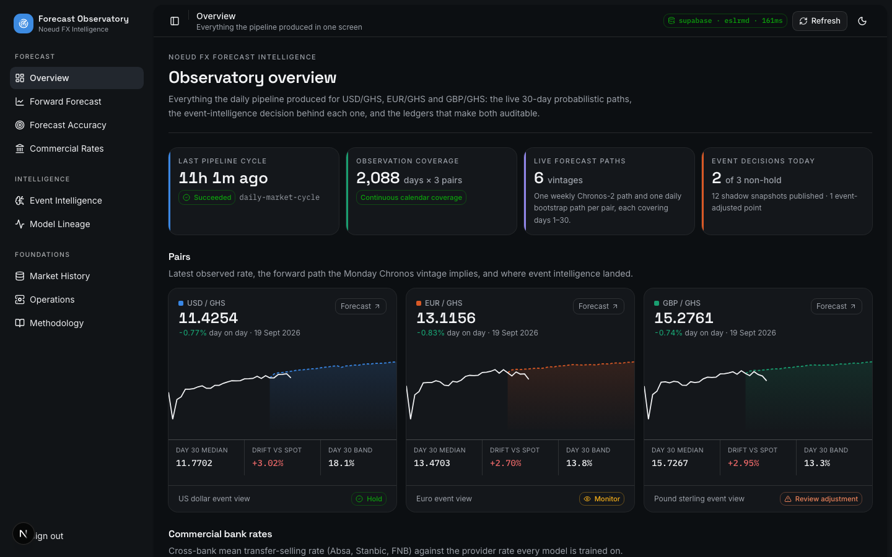
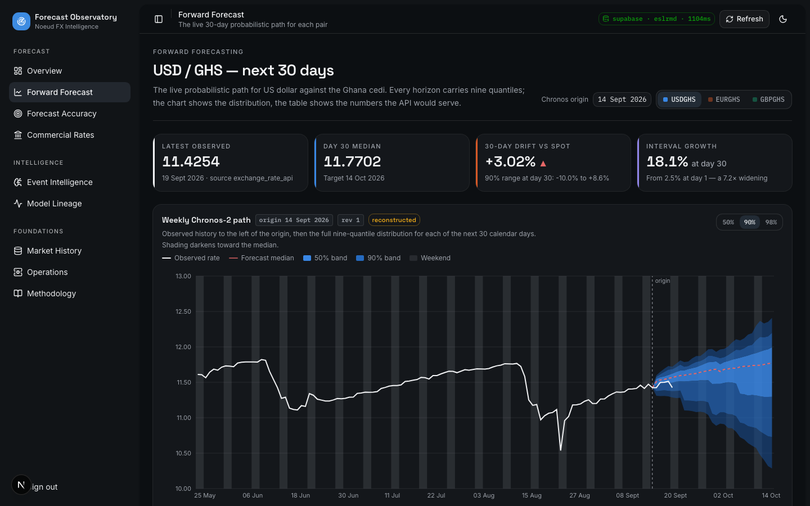
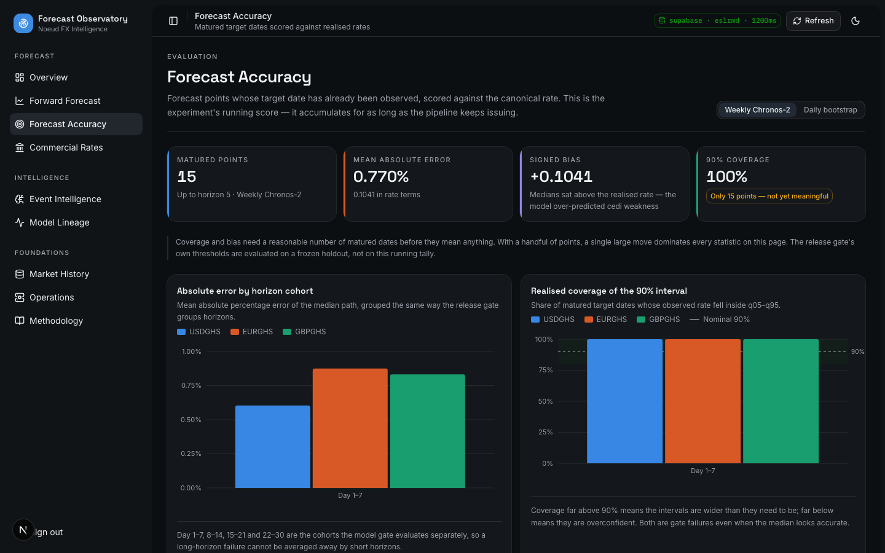
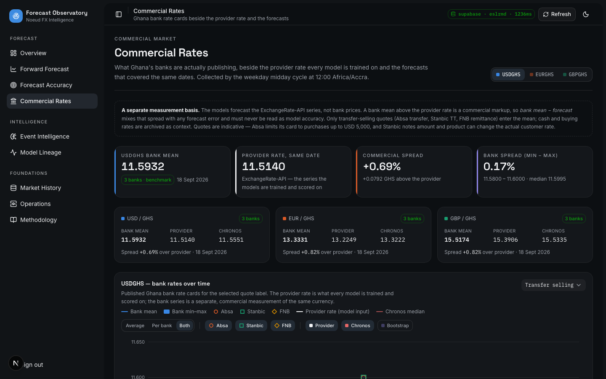
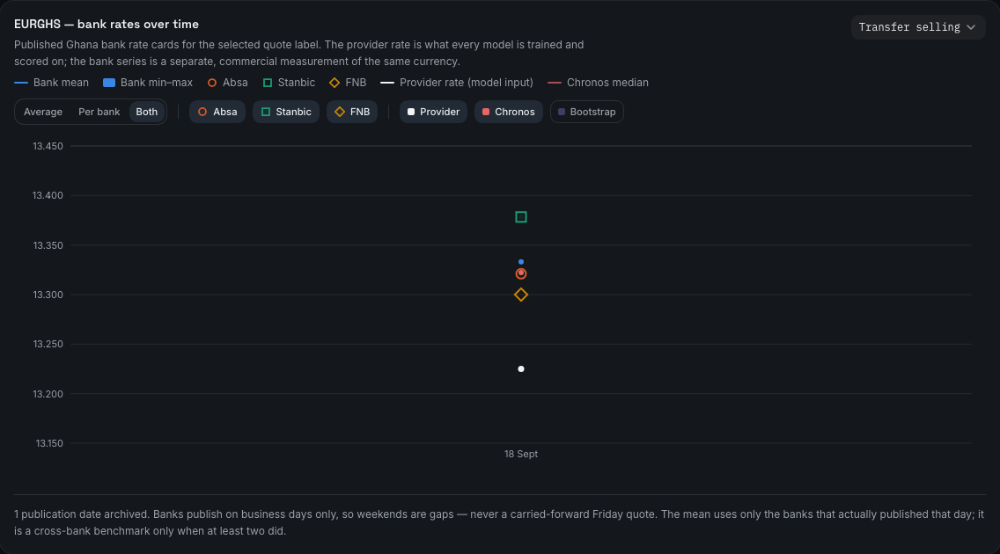
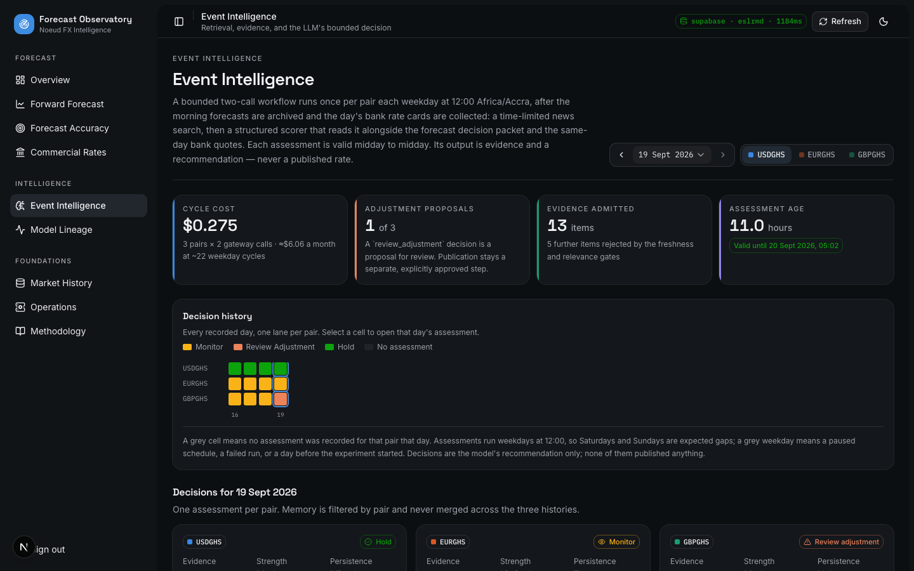
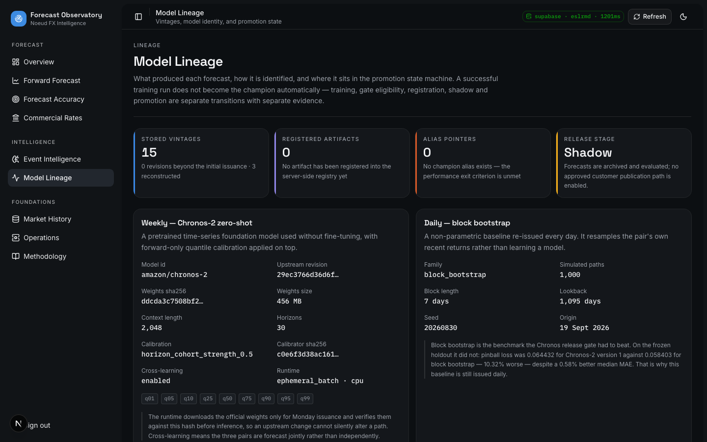
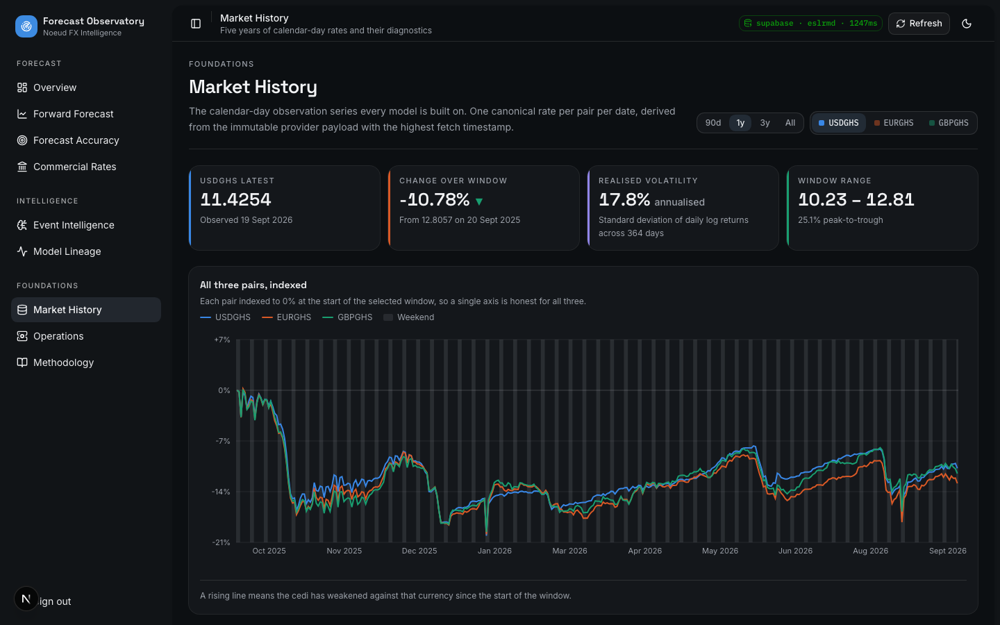
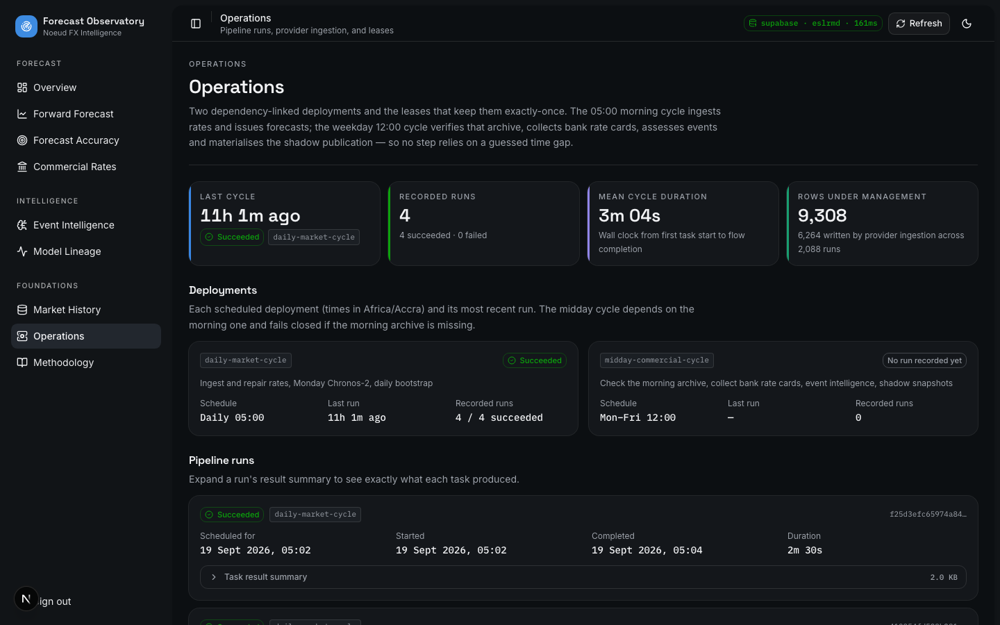

# Noeud Forecast Observatory

Internal monitoring surface for
[**Noeud FX Forecast Intelligence**](https://github.com/getnoeud/noeud-fx-forecast-intelligence) — the
service that produces probabilistic 30-calendar-day forecasts of USD/GHS,
EUR/GHS and GBP/GHS.

The observatory exists so the team can watch a live experiment run for weeks
without reading the database by hand: what the models are forecasting, what
the event-intelligence layer concluded and why, how yesterday's forecasts
scored against today's rate, what Ghana's banks are actually charging for the
same currencies, and whether the pipeline is actually running.

The backend runs two deployments, and the observatory reflects both:

| Deployment | Schedule (Africa/Accra) | What it writes |
| --- | --- | --- |
| `daily-market-cycle` | Daily 05:00 | Provider rates, Monday Chronos-2 vintage, daily bootstrap vintage |
| `midday-commercial-cycle` | Mon–Fri 12:00 | Bank rate cards, event assessments (valid midday → midday), shadow snapshots |

It is read-only. Nothing on this dashboard writes to the forecasting database.

> **Replaces the previous observatory.** This app used to read the halted
> `noeud_ml_forecast` FastAPI backend. That contract, its sentiment tables and
> its `7d` horizon focus are gone; the app now reads the `noeud_forecast`
> Supabase schema directly.

## Pages

| Route | What it answers |
| --- | --- |
| `/` | What did the pipeline produce today, across all three pairs? |
| `/forecast` | What is the live 30-day distribution, and what did each model say about each date? |
| `/accuracy` | How are matured forecasts scoring against the rates that actually printed? |
| `/commercial` | What are Absa, Stanbic and FNB publishing, and how far is that from the provider rate and the forecast? |
| `/intelligence` | What did the LLM read, reject, and conclude — on any recorded day? |
| `/models` | Which model produced this, how is it identified, and where is it in the promotion state machine? |
| `/market` | Five years of calendar-day rates, their diagnostics, and any suspect prints |
| `/operations` | Pipeline runs, provider ingestion, and the leases that keep work exactly-once |
| `/methodology` | How every number on the dashboard is produced |

---

### Overview

Latest rate, day-on-day change, the forward path per pair, the event decision
that landed for each one, and a commercial bank-rates card per pair (latest
bank mean vs. the provider rate, the spread, and how both have moved since
collection began) — the one screen you check first.



### Forward Forecast — the centrepiece

The full nine-quantile fan for the next 30 calendar days, with a 50 / 90 / 98%
coverage toggle. Observed history sits to the left of the origin marker; target
dates that have already matured stay drawn on the observed line *inside* the
fan, so a miss is visible the day after issuance instead of at the end of the
month.



Below the main fan, an **"Observed against both model views"** chart puts the
realised rate, the Chronos median and the bootstrap median on one axis by
target date — left of the marker all three are settled, right of it only the
models have an opinion. Because the daily bootstrap is re-issued every day,
its fan chart and its "path in numbers" table are built **walk-forward**: each
past date keeps whichever stored vintage most recently forecast it (typically
yesterday's one-day-ahead call), so a matured prediction stays on the chart
instead of vanishing the moment tomorrow's vintage supersedes it. A `Chronos
origin` picker lets you reopen any past Monday vintage exactly as it was
issued.

Bank rates appear here too, on their own basis: the tracking chart has a
toggleable **Bank mean** series (with its min–max range), and every "path in
numbers" table has **Bank mean** and **Bank vs median** columns on the dates
banks published.

### Forecast Accuracy

Matured forecast points scored against canonical observations: error by
horizon cohort, realised coverage of the 90% interval, signed bias, and a
calibration scatter of forecast vs. realised — plus the pipeline's own audited
evaluation ledger where it exists.



### Commercial Rates

Published Ghana bank rate cards — Absa (transfer), Stanbic (TT) and FNB
(remittance) — collected each weekday at 12:00, beside the provider rate every
model is trained on and the forecasts that covered the same dates. Per-pair
tiles give the latest bank mean, provider rate, commercial spread and the
spread *between* banks; the benchmark is only flagged as such when at least two
banks published.



The **bank rates over time** chart switches between the cross-bank average
(with its min–max band), individual banks, or both; any bank can be toggled
off; the quote label can be changed (transfer/cash, buying/selling); and the
provider rate, Chronos median and bootstrap median can be overlaid. Banks are
drawn as hollow markers with their own shape as well as colour, because they
routinely quote within a pesewa of each other — and of the model median — and
a filled dot would silently hide whichever was drawn first.



Below it: the commercial spread over the provider for all three pairs, each
bank's own buy/sell margin (transfer or cash), the full rate card for the
latest date, the backend's benchmark-vs-provider-vs-forecast comparison table,
and the append-only quote ledger with each row's source document and hash.

> **The bank series is not a forecast target.** The models forecast the
> ExchangeRate-API series, so a bank mean above it is a commercial markup, not a
> model miss — *bank mean − forecast* mixes that spread with forecast error and
> is never shown as accuracy. The quotes are indicative (Absa caps its card at
> USD 5,000), so they are for monitoring, not settlement.

### Event Intelligence

The bounded two-call LLM workflow, now run in the weekday 12:00 cycle after the
bank rates are collected, with each assessment valid midday to midday: cost and
latency per stage, the evidence composition, and — for any recorded day, via
the assessment-day picker and the decision-history strip — the full reasoning,
evidence table (with what was rejected and why), gateway call audit, and the
exact bank quotes the scorer was given (`events-v2.8` onward; earlier
assessments say plainly that they had none). Weekends are expected gaps in the
decision history.



### Model Lineage

What produced each forecast, how it is identified (pinned revision, verified
weights hash, calibration recipe), and where it sits in the promotion state
machine — training → candidate → gate → shadow → champion. No alias moves on
its own; a failed gate stays part of the record.



### Market History

Five years of calendar-day rates: an indexed multi-pair view, rolling
volatility, return correlation, and a table of single-day moves large enough
to be a suspect provider print rather than a market event.



### Operations

A status card per deployment (morning and midday — including "no run recorded
yet" before the midday cycle's first run), pipeline runs with their task result
summaries, the event/retrieval leases that keep work exactly-once, provider
ingestion by request kind, and a live row count for every table in the schema.



---

### Things worth knowing about the UI

- **Time travel.** `/forecast` has a Chronos-origin selector and
  `/intelligence` has an assessment-day selector, both URL-driven
  (`?origin=…`, `?date=…`), so any historical state is linkable. The decision
  history strip on `/intelligence` doubles as navigation — click a cell to
  reopen that day.
- **Walk-forward series.** The daily bootstrap is re-issued every day, so a
  single vintage only ever looks forward. Its fan chart and horizon table are
  instead built from `buildWalkForwardPoints` (`src/lib/analytics.ts`), which
  merges every stored origin and lets each date keep its most recently issued
  forecast — a matured prediction is never dropped just because a newer
  vintage's window moved past it.
- **Weekends are shaded.** FX rates are quoted every calendar day here, but the
  market is shut at the weekend: the provider repeats Friday's rate while the
  models still forecast Saturday and Sunday. Every date-based chart draws a
  faint grey band behind Saturday–Sunday (observed and forecast days alike,
  with a "Weekend" legend entry), and the D1–D30 horizon charts shade the
  horizons that land on a weekend. It makes flat stretches read as a closed
  market rather than a calm one, and shows which forecast days fall when banks
  do not publish. Windows longer than about 400 days skip the bands, where they
  would shrink to a few pixels.
- **Every table is paginated**, with its own rows-per-page control
  (10 / 25 / 50 / 100), via the shared `PaginatedTable` component. The
  dropdowns themselves — page size, time-travel pickers — use the app's own
  styled `Select`, not a bare native `<select>`.
- **Failed reads are shown as failed reads.** There is no fixture fallback: a
  dashboard that silently mixes live and mock rows is worse than one that is
  visibly down.

## Data access

The `noeud_forecast` schema is deliberately **absent from the Supabase Data
API's exposed-schema list**, so no browser key can reach it and PostgREST is
not an option. The observatory therefore reads PostgreSQL directly from the
Next.js server and ships rendered HTML:

```text
Server Component  ->  lib/server/views.ts | forecast-view.ts   (page models)
                  ->  lib/server/queries.ts                    (typed SQL reads)
                  ->  lib/server/db.ts                         (pg Pool, server-only)
                  ->  Supabase session pooler (IPv4, TLS)
```

`lib/analytics.ts` holds every derivation (fan rows, walk-forward merges,
interval widths, skew, rolling volatility, correlation, accuracy rollups) as
pure functions shared by server and client, so charts never recompute anything
the tables disagree with.

### Environment

Copy `.env.example` to `.env` and fill it in.

```env
OBSERVATORY_SHARED_SECRET=...
OBSERVATORY_COOKIE_SECRET=...
OBSERVATORY_DATABASE_URL=postgresql://<role>.<project-ref>:<password>@<pooler-host>:5432/postgres
OBSERVATORY_DB_SCHEMA=noeud_forecast
OBSERVATORY_DB_POOL_MAX=4
NEXT_PUBLIC_SUPABASE_PROJECT_REF=...
NEXT_PUBLIC_FORECAST_TIMEZONE=Africa/Accra
```

Notes:

- Use the **session pooler** URI from Supabase → Connect. The direct
  `db.<ref>.supabase.co` host is IPv6-only and will not resolve on most
  networks.
- `sslmode` in the URI is stripped at runtime; TLS is configured explicitly
  because Supabase's chain is not in the local trust store.
- **Use the least-privilege reader login.** The backend repo provisions
  `noeud_forecast_api` via `noeud-forecast provision-postgres-roles`; point
  `OBSERVATORY_DATABASE_URL` at that role rather than the database owner. The
  observatory only ever issues `SELECT`.
- `OBSERVATORY_DATABASE_URL` is server-only and is never sent to the browser.

## Run

```bash
npm install
npm run dev
```

Open `http://localhost:3000`. You will be asked for the shared observatory key
(`OBSERVATORY_SHARED_SECRET`) before anything renders. The field has a show/hide (eye) toggle so you can check what you typed.

```bash
npm run build
npm run start
npm run lint
```

## Auth

Shared-secret login, HMAC-signed HTTP-only session cookie, route protection in
`src/proxy.ts`. Deliberately simple: this is an internal dashboard for a
time-boxed experiment, not a product surface. Full identity is out of scope.

## Stack

Next.js App Router (16) · TypeScript · shadcn/ui on Base UI · Recharts ·
Tailwind v4 · `pg`.

Charts follow a fixed, validated categorical palette (`src/app/globals.css`):
slots 1–3 are the pair identities and clear the colour-vision-deficiency and
normal-vision separation floors in both light and dark mode; the four status
colours are reserved and always ship with an icon and a label, never colour
alone.

## Key files

- `src/lib/server/db.ts` — connection pool, reload-aware in dev
- `src/lib/server/queries.ts` — every SQL read, one function per question
- `src/lib/server/views.ts`, `forecast-view.ts`, `commercial-view.ts` — page-level models
- `src/lib/commercial.ts` — bank identity, quote labels, the cross-bank mean and margin derivations
- `src/lib/analytics.ts` — derivations shared by server and client, including
  the walk-forward merge
- `src/components/charts/` — the chart library
- `src/components/obs/` — observatory-specific UI (badges, paginated tables,
  the styled `InlineSelect`, time-travel pickers)
- `src/app/methodology/page.tsx` — the written explanation of everything above

## Related

- [`../noeud-fx-forecast-intelligence/docs/supabase-setup-runbook.md`](https://github.com/getnoeud/noeud-fx-forecast-intelligence/blob/main/docs/supabase-setup-runbook.md)
- [`../noeud-fx-forecast-intelligence/docs/commercial-rate-benchmark.md`](../noeud-fx-forecast-intelligence/docs/commercial-rate-benchmark.md)
- [`../noeud-fx-forecast-intelligence/docs/event-intelligence.md`](https://github.com/getnoeud/noeud-fx-forecast-intelligence/blob/main/docs/event-intelligence.md)
- [`../noeud-fx-forecast-intelligence/docs/model-gates.md`](https://github.com/getnoeud/noeud-fx-forecast-intelligence/blob/main/docs/model-gates.md)
- [`../noeud-fx-forecast-intelligence/supabase/migrations/`](https://github.com/getnoeud/noeud-fx-forecast-intelligence/tree/main/supabase/migrations)
