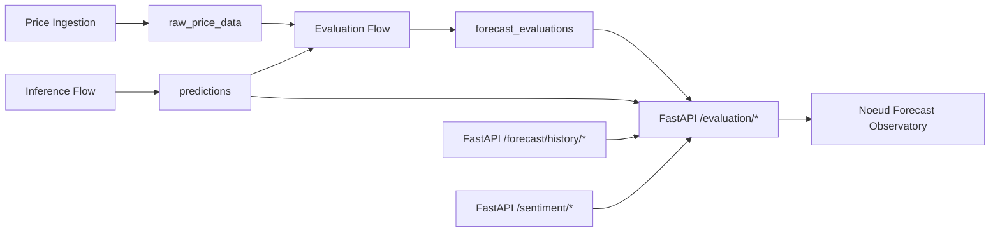

# Noeud Forecast Observatory

Internal dashboard for tracking how Noeud forecasts perform in the real world after they mature against actual market data.

The observatory is intentionally small and practical for beta:

- it reads data from the `noeud_ml_forecast` FastAPI backend
- it does not connect to Supabase directly
- it focuses on `7d` first, while remaining horizon-aware for future `30d+` rollout
- it helps the ML team audit forecast quality, sentiment contribution, and recent forecast issuance behavior

## What This App Does

The observatory answers questions like:

- how many forecasts have matured and been evaluated
- what the current directional hit rate, MAE, RMSE, and bias look like
- whether sentiment-adjusted forecasts are beating the quant-only baseline
- how one pair is performing over time
- what the latest forecast path and recent forecast issuances looked like

Main pages:

- `/`
  - overview dashboard
- `/pairs/[pair]`
  - pair review page
- `/reports/weekly`
  - performance reports
- `/help`
  - explanations of the evaluation pipeline and metrics
- `/settings`
  - lightweight internal settings page

## Architecture



## Repository Setup

This app lives as a separate Next.js project alongside the main forecasting backend.

Expected sibling layout:

```text
noeud/
  noeud_ml_forecast/
  noeud-forecast-observatory/
```

## Tech Stack

- Next.js App Router
- TypeScript
- shadcn/ui
- Recharts via shadcn chart wrappers
- TanStack Query
- TanStack Table
- Zustand
- Axios

## Requirements

- Node.js 20+
- npm
- running `noeud_ml_forecast` backend

## Environment Variables

Copy `.env.example` to `.env.local` or `.env`.

```bash
cp .env.example .env.local
```

Current variables:

```env
# Observatory auth shared secret
OBSERVATORY_SHARED_SECRET=change-me-in-production
OBSERVATORY_COOKIE_SECRET=change-me-cookie-secret

# FastAPI backend base URL
NEXT_PUBLIC_API_BASE_URL=http://localhost:8000
```

Notes:

- `OBSERVATORY_SHARED_SECRET`
  - shared password used by the internal login form
- `OBSERVATORY_COOKIE_SECRET`
  - used to sign the HTTP-only session cookie
- `NEXT_PUBLIC_API_BASE_URL`
  - points to the running `noeud_ml_forecast` API

The API client also supports `NEXT_PUBLIC_FORECAST_API_BASE_URL` as a fallback, but `NEXT_PUBLIC_API_BASE_URL` is the preferred name going forward.

## Install And Run

From `noeud-forecast-observatory`:

```bash
npm install
npm run dev
```

Open:

- `http://localhost:3000`

You will be redirected to the internal login page first.

## Backend Dependency

This dashboard depends on the forecasting backend being up and returning data from these endpoints:

- `GET /evaluation/overview`
- `GET /evaluation/history/{currency_pair}`
- `GET /evaluation/reports/weekly`
- `GET /evaluation/export`
- `GET /forecast/history/{currency_pair}`
- `GET /sentiment/{currency_pair}/history`

If the backend is unavailable, the overview page will show a retry state instead of metrics.

## Getting Data Into The Dashboard

The observatory only becomes useful when the backend has:

- forecast history in `predictions`
- matured evaluation rows in `forecast_evaluations`

For a detailed explanation of that pipeline, read:

- `../noeud_ml_forecast/docs/EVALUATION_PIPELINE_PLAYBOOK.md`

### Real data path

Normal production flow:

1. ingest latest market prices
2. run inference and save new predictions
3. evaluate matured forecasts
4. read those matured rows through `/evaluation/*`

### Demo bootstrap path

If you want data in the dashboard before real forecasts mature, seed demo rows from the backend repo:

```bash
cd ../noeud_ml_forecast
uv run python scripts/manage_demo_evaluations.py seed --pairs USDGHS GHSKES --horizon 7 --count 12
```

To clear the demo data:

```bash
cd ../noeud_ml_forecast
uv run python scripts/manage_demo_evaluations.py clear
```

## Useful Commands

```bash
npm run dev
npm run lint
npm run build
npm run start
```

## Authentication Model

This is an internal dashboard for beta, not a public app.

Current auth model:

- shared secret login
- HTTP-only signed session cookie
- route protection via `src/proxy.ts`

This is intentionally simple for the current stage. Full identity/authz is deferred.

## Current Feature Scope

Implemented:

- overview KPI cards
- rolling performance chart
- pair leaderboard, direction analysis, and sentiment impact tables
- pair review pages
- recent forecast issuance monitoring
- sentiment overlay charts
- weekly performance report page
- CSV export from the reports view
- help/settings pages
- frontend CI for pull requests

Still intentionally lightweight:

- no direct Supabase client in the frontend
- no public/investor mode
- no full account system
- no monthly locked reporting flow yet

## Frontend CI

GitHub Actions workflow:

- `.github/workflows/frontend-ci.yml`

Runs on pull requests targeting:

- `dev`
- `staging`
- `master`

Checks:

- `npm ci`
- `npm run lint`
- `npm run build`

## Troubleshooting

### Dashboard loads but shows no evaluation data

Likely causes:

- backend API is not running
- `NEXT_PUBLIC_API_BASE_URL` points to the wrong backend
- you have predictions but no matured evaluations yet

Check:

- `../noeud_ml_forecast/docs/EVALUATION_PIPELINE_PLAYBOOK.md`

### Pair pages or reports load but look sparse

That usually means:

- only a small seeded dataset exists
- only one horizon has been evaluated
- the selected pair has little or no matured history yet

### Login keeps failing

Check:

- `OBSERVATORY_SHARED_SECRET`
- `OBSERVATORY_COOKIE_SECRET`
- whether your browser is accepting cookies for local development

## Key Files

- `src/app/page.tsx`
- `src/app/pairs/[pair]/page.tsx`
- `src/app/reports/weekly/page.tsx`
- `src/components/chart-area-interactive.tsx`
- `src/components/dashboard/pair-detail-dashboard.tsx`
- `src/hooks/use-observatory.ts`
- `src/lib/api.ts`
- `src/store/observatory-store.ts`
- `src/proxy.ts`

## Related Docs

- `../noeud_ml_forecast/docs/EVALUATION_PIPELINE_PLAYBOOK.md`
- `../noeud_ml_forecast/docs/API_CONTRACTS.md`
- `../noeud_ml_forecast/docs/TECHNICAL_ARCHITECTURE.md`
